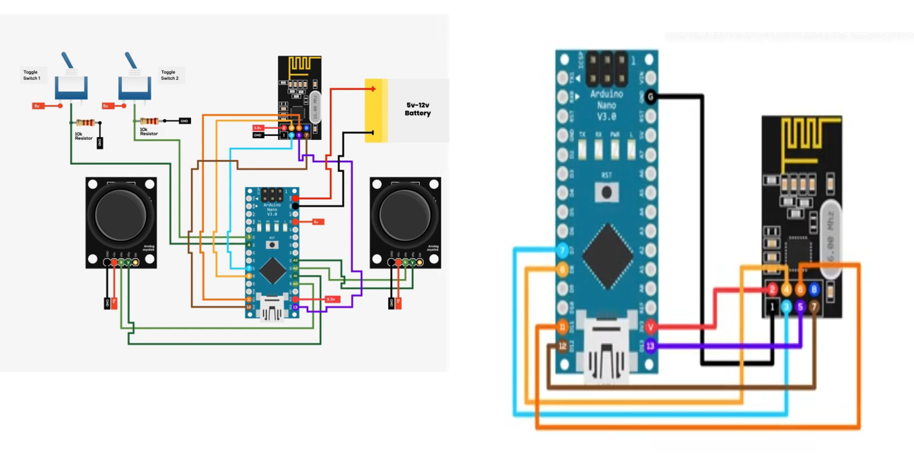

# Ornithopter-Control-System

# 🦅 Ornithopter Control System for Defense and Rescue


> **Bio-inspired aerial surveillance and rescue system using flapping-wing flight, wireless control, and machine learning.**

---

## 🔍 Project Summary (Recruiter View)

The **Ornithopter Control System for Defense and Rescue** is a **bio-inspired drone system** that mimics bird flight to achieve **high maneuverability, stealth, and efficiency** in environments where traditional drones fail.

The project combines:

* **Embedded systems**
* **Wireless communication**
* **Computer vision (YOLO)**
* **Autonomous control**

It is designed for **defense surveillance**, **search & rescue**, and **disaster response** scenarios.

---

## 🚀 Key Highlights

* 🦜 **Flapping-wing (ornithopter) flight mechanism**
* 🎮 **Manual + autonomous control**
* 📡 **Wireless communication (NRF24L01)**
* 📷 **Real-time video streaming**
* 🔥 **Fire & smoke detection using YOLO**
* ⚡ **Lightweight & energy-efficient design**
* 🖥 **User-friendly control interface**

---

## 🧠 System Architecture

### Overall Architecture


**Modules:**

* Control Module
* Communication Module
* Power Management Module
* Sensor & Camera Module
* Machine Learning Module

---

## 🔧 Hardware Stack



* Arduino Nano
* Coreless DC Motors + Propellers
* NRF24L01 Wireless Module
* PS2 Joystick Module
* TP4056 Charging Module
* 3.7V Li-ion Battery (1.8Ah)
* DC-DC Boost Converter
* OLED Display
* MOSFET Driver (IRF520)
* Sensors & Push Buttons

---

## 💻 Software & Technologies

| Category         | Tools                      |
| ---------------- | -------------------------- |
| Embedded         | Arduino IDE                |
| Programming      | Python                     |
| Computer Vision  | OpenCV                     |
| Machine Learning | YOLO (Ultralytics)         |
| Wireless         | NRF24L01                   |
| UI / Control     | Serial & Display Interface |

---

## 🔥 Machine Learning – Fire Detection


* YOLO-based object detection
* Real-time fire and smoke recognition
* Live bounding boxes with confidence score
* Used for **early disaster detection**

---

## 🎮 Controller & Communication


* Wireless transmitter–receiver setup
* Low-latency communication
* Reliable control in real-time
* Manual override supported

---

## 📊 Results & Performance

* ✅ Stable autonomous and manual flight
* ✅ Accurate fire & smoke detection
* ✅ Reliable wireless communication
* ✅ Real-time sensor and video feedback
* ✅ Successful test scenarios for rescue & surveillance

---

## 🔮 Future Enhancements

* 🤖 Advanced AI models for threat classification
* 🕸 Swarm intelligence (multiple ornithopters)
* 🔋 Improved battery & solar integration
* 📶 5G / long-range communication
* 🚑 Payload delivery (medical kits, sensors)

---

## 🧑‍💻 Skills Demonstrated (For Recruiters)

* Embedded Systems (Arduino)
* Wireless Communication
* Computer Vision & YOLO
* Machine Learning Integration
* Real-Time Systems
* Hardware–Software Co-Design
* Defense & Rescue Tech Applications

---

## 📁 Project Structure (Suggested)

```
ornithopter-control-system/
├── arduino/
│   ├── transmitter/
│   └── receiver/
├── ml/
│   └── fire_detection.py
├── docs/
│   └── images/
├── report/
│   └── project-report.pdf
└── README.md
```

---

## 👨‍🎓 Author

**Abihassan K**
* 🎓 B.Tech – Computer Science and Engineering
* 🏫 Hindustan Institute of Technology and Science, Chennai
* 📧 Email: [Abihassan415.k@gmail.com](mailto:Abihassan415.k@gmail.com)

---

## 📜 License

This project is developed for **academic and educational purposes**.
Free to use for learning and research with attribution.

---

⭐ *If you like this project, feel free to star the repository!*
